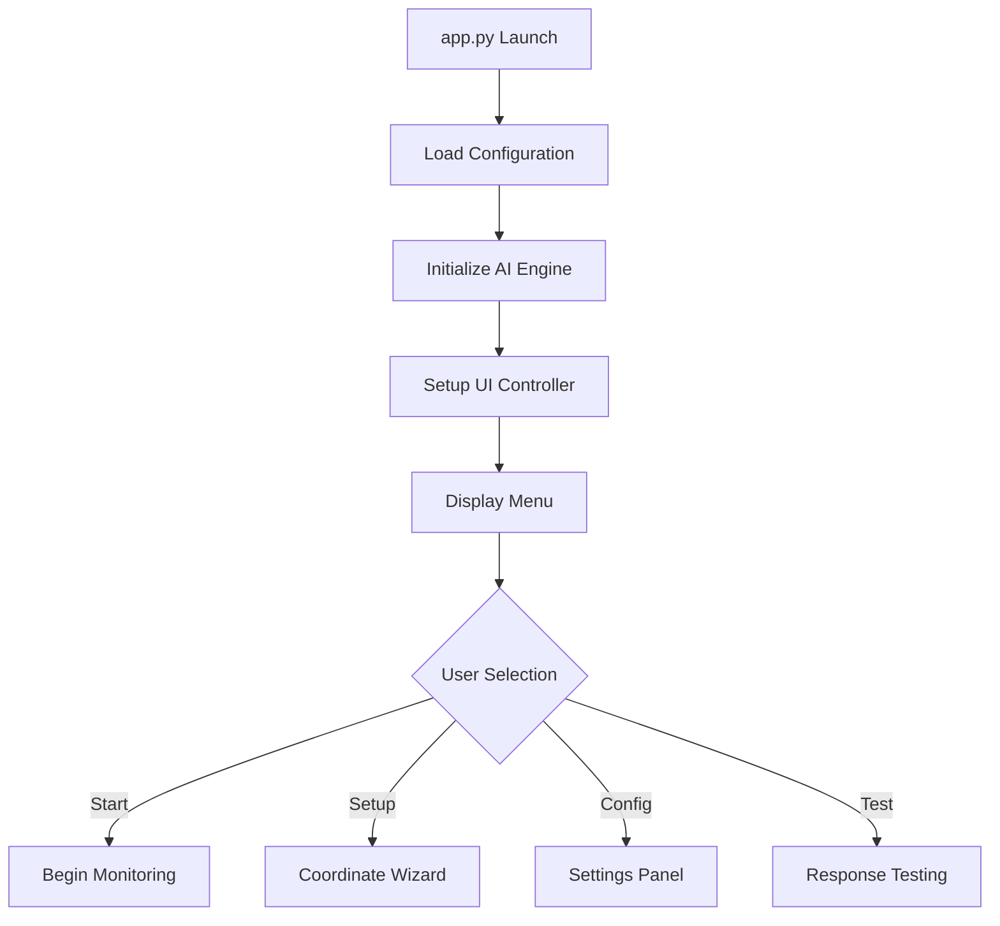
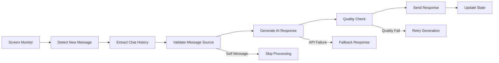
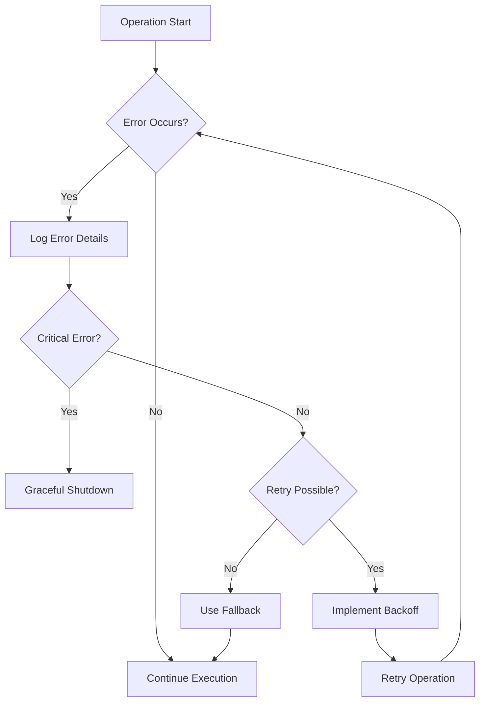

# AutoReplyPro Architecture Documentation

This document provides a comprehensive technical overview of AutoReplyPro's architecture, design patterns, and implementation details.

## 🏗️ System Architecture

### **High-Level Architecture**

AutoReplyPro follows a modular, layered architecture that separates concerns and promotes maintainability:

```
┌─────────────────────────────────────────────────────────────┐
│                    Application Layer                        │
├─────────────────────────────────────────────────────────────┤
│  app.py (Main Entry Point)                                 │
│  • Application bootstrap                                   │
│  • Menu-driven interface                                   │
│  • Lifecycle management                                    │
└─────────────────────────────────────────────────────────────┘
                               │
                               ▼
┌─────────────────────────────────────────────────────────────┐
│                    Presentation Layer                       │
├─────────────────────────────────────────────────────────────┤
│  GUI (PySimpleGUI) + CLI Interface                         │
│  • User interaction management                             │
│  • Configuration wizards                                   │
│  • Real-time status updates                               │
└─────────────────────────────────────────────────────────────┘
                               │
                               ▼
┌─────────────────────────────────────────────────────────────┐
│                     Business Logic Layer                    │
├─────────────────┬─────────────────┬─────────────────────────┤
│   AI Engine     │ Config Manager  │    UI Controller        │
│                 │                 │                         │
│ • NLP Processing│ • Settings Mgmt │ • Screen Automation     │
│ • Model Management • Data Persist │ • Image Recognition    │
│ • Fallback Logic│ • Validation    │ • Coordinate Mapping   │
└─────────────────┴─────────────────┴─────────────────────────┘
                               │
                               ▼
┌─────────────────────────────────────────────────────────────┐
│                    Infrastructure Layer                     │
├─────────────────┬─────────────────┬─────────────────────────┤
│  External APIs  │ File System     │  Operating System       │
│                 │                 │                         │
│ • Cohere API    │ • JSON Storage  │ • Screen Capture        │
│ • HTTP Clients  │ • Asset Files   │ • UI Automation         │
│ • Rate Limiting │ • Logging       │ • Process Management    │
└─────────────────┴─────────────────┴─────────────────────────┘
```

## 📦 Component Architecture

### **1. AI Engine (`src/ai_engine.py`)**

**Purpose**: Manages all AI-related functionality including response generation, model selection, and fallback mechanisms.

**Key Components:**
```python
class AIEngine:
    """Core AI processing engine with Cohere integration."""
    
    # Core Methods
    def initialize_client(api_key: str) -> bool
    def generate_response(chat_history: str, **kwargs) -> str
    def _api_call_with_timeout(chat_history: str) -> Tuple[Response, Error]
    def _get_fallback_response() -> str
    def _create_prompt(chat_history: str, persona: str) -> str
```

**Design Patterns:**
- **Strategy Pattern**: Multiple AI models (Command-A vs Command-R)
- **Circuit Breaker**: API timeout and fallback mechanisms
- **Factory Pattern**: Dynamic prompt generation based on configuration

**Data Flow:**
```
Chat History → Prompt Engineering → API Call → Response Processing → Output
     │                                ↓
     └─────────── Fallback Logic ←──── Timeout/Error
```

### **2. Configuration Manager (`src/config_manager.py`)**

**Purpose**: Centralized configuration management with persistence, validation, and defaults.

**Key Features:**
- **Atomic Operations**: Thread-safe read/write operations
- **Schema Validation**: Configuration schema enforcement
- **Migration Support**: Backward compatibility for config versions
- **Default Handling**: Graceful fallback to defaults

**Configuration Schema:**
```json
{
  "api_settings": {
    "api_key": "string",
    "model": "command-a-03-2025|command-r-03-2025",
    "timeout": "5-60 seconds",
    "fallback_mode": "boolean"
  },
  "persona_settings": {
    "name": "string",
    "language_mix": "Hindi-English|English|Hindi",
    "tone": "warm|professional|casual|funny",
    "max_length": "10-50 words"
  },
  "ui_settings": {
    "whatsapp_coords": "[x, y]",
    "chat_area": "object",
    "message_box_coords": "[x, y]",
    "check_interval": "1-30 seconds"
  }
}
```

### **3. UI Controller (`src/ui_controller.py`)**

**Purpose**: Abstracts platform-specific UI automation with computer vision integration.

**Architecture:**
```python
class UIController:
    """Platform-agnostic UI automation with CV integration."""
    
    # Core Automation
    def find_and_click(image_name: str) -> bool
    def copy_chat_text() -> str
    def send_message(text: str) -> bool
    def setup_coordinates() -> bool
    
    # Computer Vision
    def locate_ui_element(template: str) -> Optional[Tuple[int, int]]
    def capture_screen_region(bounds: dict) -> np.ndarray
    def template_match(template: str, threshold: float) -> bool
```

**Image Recognition Pipeline:**
```
Screen Capture → Template Matching → Coordinate Calculation → Action Execution
      │                    │                   │                    │
      ▼                    ▼                   ▼                    ▼
  Screenshot         Find Template       Compute Center      Click/Type
   (PIL/CV2)         (OpenCV)           (Geometry)          (PyAutoGUI)
```

### **4. GUI Interface (`src/gui.py`)**

**Purpose**: Provides user-friendly graphical interface with real-time feedback.

**Interface Components:**
- **Configuration Panels**: API settings, persona configuration
- **Status Dashboard**: Real-time operation status
- **Testing Interface**: Response quality validation
- **Setup Wizards**: Guided coordinate calibration

## 🔄 System Workflows

### **1. Application Startup Flow**



### **2. Message Processing Pipeline**



### **3. Error Handling Strategy**



## 🧵 Concurrency Model

### **Threading Architecture**

AutoReplyPro uses a multi-threaded architecture for non-blocking operations:

```python
# Main Thread: UI and user interaction
main_thread = Thread(target=ui_main_loop)

# Scanner Thread: Message monitoring
scanner_thread = Thread(target=message_scanner, daemon=True)

# API Thread: AI response generation (with timeout)
api_thread = Thread(target=api_call_with_timeout, daemon=True)
```

**Thread Safety Measures:**
- **Configuration Access**: Thread-safe config reads/writes
- **Shared State**: Atomic operations for state updates
- **Resource Management**: Proper cleanup on thread termination
- **Timeout Handling**: Graceful thread cancellation

### **Asynchronous Operations**

```python
def start_scanning(self):
    """Start non-blocking message monitoring."""
    if not self.running:
        self.running = True
        self.scan_thread = threading.Thread(
            target=self._scan_loop, 
            daemon=True
        )
        self.scan_thread.start()

def _api_call_with_timeout(self, chat_history):
    """API call with timeout protection."""
    result = {"response": None, "error": None}
    
    def make_call():
        try:
            result["response"] = self.co.chat(...)
        except Exception as e:
            result["error"] = e
    
    api_thread = threading.Thread(target=make_call)
    api_thread.start()
    api_thread.join(timeout=self.config['api_timeout'])
    
    if api_thread.is_alive():
        return None, TimeoutError("API timeout")
    return result["response"], result["error"]
```

## 🔒 Security Architecture

### **API Key Management**

```python
class SecureConfig:
    """Secure configuration management."""
    
    def store_api_key(self, key: str):
        """Store API key with basic obfuscation."""
        # In production: Use proper encryption
        encoded_key = base64.b64encode(key.encode()).decode()
        self.config['api_key_hash'] = encoded_key
    
    def retrieve_api_key(self) -> str:
        """Retrieve and decode API key."""
        encoded = self.config.get('api_key_hash', '')
        return base64.b64decode(encoded).decode()
```

### **Data Privacy**
- **Local Processing**: All chat analysis happens locally
- **Minimal Data Transfer**: Only necessary context sent to AI API
- **No Data Persistence**: Chat content not stored permanently
- **User Consent**: Clear documentation of data usage

### **Access Control**
- **Screen Access**: Requires explicit user permission
- **Clipboard Access**: Minimal usage, cleared after operations
- **Network Access**: Only for AI API calls
- **File System**: Limited to configuration and assets

## 📊 Performance Considerations

### **Optimization Strategies**

1. **Response Time Optimization**
   ```python
   # Efficient prompt engineering
   def _create_optimized_prompt(self, chat_history: str) -> str:
       # Truncate history to last N messages
       recent_messages = self._get_recent_context(chat_history, limit=10)
       # Use lightweight prompt template
       return f"Context: {recent_messages}\nRespond briefly:"
   ```

2. **Memory Management**
   ```python
   # Efficient screen capture
   def capture_chat_area(self):
       # Capture only relevant screen region
       bounds = self.config['chat_area']
       screenshot = ImageGrab.grab(bbox=(
           bounds['start_x'], bounds['start_y'],
           bounds['end_x'], bounds['end_y']
       ))
       return screenshot
   ```

3. **Network Optimization**
   ```python
   # Request optimization
   def optimize_api_request(self, messages: List[dict]) -> dict:
       return {
           "model": self.config['cohere_model'],
           "messages": messages,
           "temperature": 0.75,
           "max_tokens": self.config['max_length'] * 4,
           "stop_sequences": ["\n"],  # Prevent overly long responses
       }
   ```

### **Performance Metrics**

| Operation | Target Time | Optimization |
|-----------|-------------|--------------|
| Screen Capture | < 100ms | Region-specific capture |
| Text Extraction | < 50ms | Optimized OCR/copy |
| AI Response | < 5s | Timeout protection |
| UI Automation | < 200ms | Efficient coordinate targeting |

## 🔧 Extensibility Framework

### **Plugin Architecture**

```python
class MessagePlatform(ABC):
    """Abstract base class for messaging platforms."""
    
    @abstractmethod
    def detect_new_message(self) -> bool:
        pass
    
    @abstractmethod
    def get_chat_history(self) -> str:
        pass
    
    @abstractmethod
    def send_message(self, text: str) -> bool:
        pass

class WhatsAppPlatform(MessagePlatform):
    """WhatsApp-specific implementation."""
    
    def detect_new_message(self) -> bool:
        # Implementation specific to WhatsApp UI
        pass

class TelegramPlatform(MessagePlatform):
    """Future Telegram implementation."""
    pass
```

### **AI Provider Abstraction**

```python
class AIProvider(ABC):
    """Abstract AI provider interface."""
    
    @abstractmethod
    def generate_response(self, context: str) -> str:
        pass

class CohereProvider(AIProvider):
    """Cohere API implementation."""
    pass

class OpenAIProvider(AIProvider):
    """Future OpenAI implementation."""
    pass
```

## 📝 Code Quality Metrics

### **Complexity Analysis**
- **Cyclomatic Complexity**: Target < 10 per function
- **Code Coverage**: Target > 80%
- **Dependencies**: Minimal external dependencies
- **Documentation**: Comprehensive docstrings

### **Maintainability Principles**
- **Single Responsibility**: Each class has one clear purpose
- **Open/Closed**: Open for extension, closed for modification
- **Dependency Inversion**: Depend on abstractions, not concretions
- **Interface Segregation**: Clients depend only on methods they use

## 🚀 Future Architecture Enhancements

### **Planned Improvements**
1. **Microservices**: Split into independent services
2. **Event-Driven**: Implement event bus for component communication
3. **Database Layer**: Add persistent storage for analytics
4. **API Gateway**: RESTful API for external integrations
5. **Container Support**: Docker containerization
6. **Cloud Native**: Kubernetes deployment support

### **Scalability Considerations**
- **Horizontal Scaling**: Multi-instance support
- **Load Balancing**: Request distribution
- **Caching Layer**: Response caching for common queries
- **Rate Limiting**: API usage throttling
- **Monitoring**: Comprehensive observability

---

This architecture documentation serves as a living document that evolves with the system. For implementation details, refer to the source code and inline documentation.